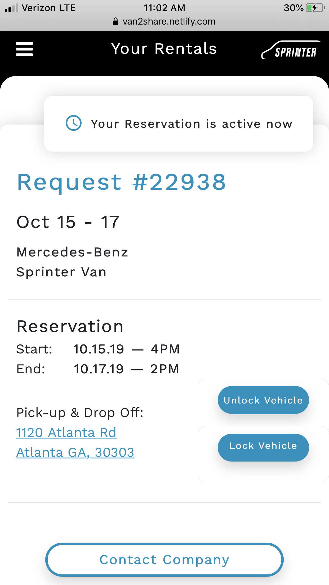

# Van2Share 

Lead front end developer for this mobile responsive web application that was built for DAIMLER/ MERCEDES-BENZ USA (Lab 1886). The application allows users to find and book Mercedes Sprinter Vans while also being able to LOCK and UNLOCK the vehicle directly from the application by implementing a custom built API for special features. 

This repository does not include the backend setup (which is in Laravel on a PRIVATE BITBUCKET). Midway through building front end, the company switched to a private Bitbucket repository and we built out from there. 

*Here you are able to get a feel for the application with a simple click through demo of some of the built out frontend. 

*I HAVE ALSO ATTACHED A LIVE INSTANCE OF THE SITE BELOW (FOR ATL SPRINTERS COMPANY)

**Use 'aaa' and 'aaa' for username and password to get past the login page. Any combination of characters will do, but do not use a valid email for the demo. 

## Technologies Used:
____
* Visual Studio Code
* Frontend: JavaScript, jQuery, HTML, CSS, Bootstrap
* Backend: PHP, Laravel, MySQL, Redis for caching
* UI/UX: Adobe XD

## Integrations
* Fleetster API
* Google maps 
* SendGrid SMTP for email
* Microsoft Azure Cloud
* MySQL Database

## Features
___

### Current Features

* Create Profile, Login, Authentication, Log Out
* Search sprinter vans, including being able to apply multiple filters
* Add to reservation, remove from reservation, manage reservations
* Check out
* Take photos of vehicle
* Unlock and lock vehicle from application
* Businesses can manage their clients and their fleets
* and more

## Live Deployed Project Link & User Stories
___
[Click Here to view Quick Demo Site](https://van2share.netlify.com/)

[Click Here to view Live Site for B2B client (ATL Sprinters)](http://booking.atlsprinters.com/)

## Quick Site Glance (Desktop & Mobile):
____

### Desktop

### Mobile

